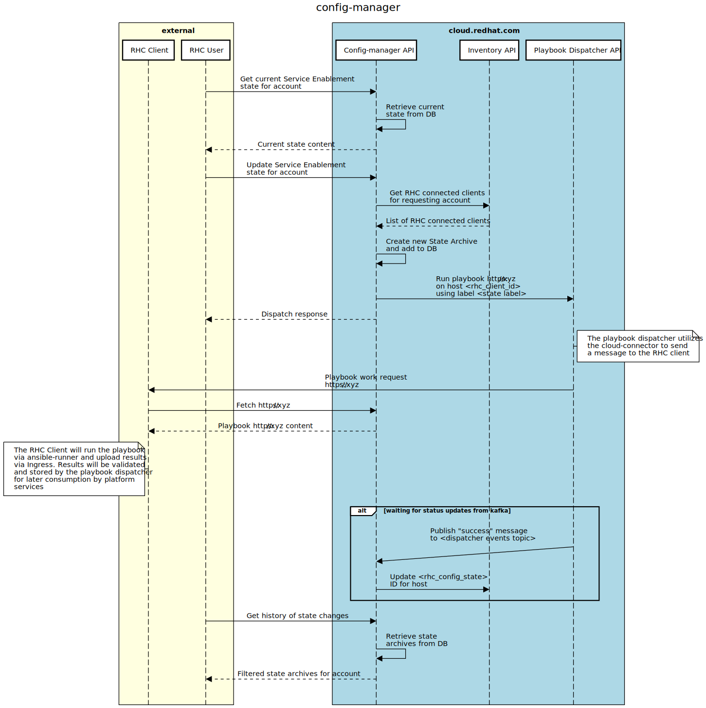

# Config Manager

Config Manager is a backend service used by the Service Enablement dashboard to enable or disable various Red Hat services on hosts connected through RHC.

Config Manager handles the following actions:

- Retrieves the current configuration (enabled/disabled) of various services supported by Service Enablement
- Updates the current configuration of services
- Maintains a history of configuration changes
- Ensures that newly connected hosts are kept up to date with the latest configuration
- Updates the host record in Inventory with the latest "rhc_config_state" ID

Config Manager has two mechanisms to update a host:

- Via a change in the Service Enablement dashboard
- Via a new rhc connection event from Inventory

Updating a host (all hosts) via the API:



Automatic updating of a newly connected host via kafka:

Todo

## REST interface

The REST interface can be used to view and update the current configuration for all hosts connected through RHC. It can also be used to view a history of previous configuration changes, and obtain logs related to those changes.

See the [OpenAPI Schema](./schema/api.spec.yaml) for details on interacting with the REST interface.

## Development

### Prerequisities

- Golang >= 1.13

### Running the service

Run `podman-compose up --build -d` to start the service and its dependencies

The API can be accessed locally on port 8081, and this port can be adjusted by setting the CM_WEBPORT environment variable.

```sh
curl -v -H "x-rh-identity: eyJpZGVudGl0eSI6eyJpbnRlcm5hbCI6eyJvcmdfaWQiOiI1MzE4MjkwIn0sImFjY291bnRfbnVtYmVyIjoiOTAxNTc4IiwidXNlciI6e30sInR5cGUiOiJVc2VyIn19Cg==" http://localhost:8081/states/current
```
